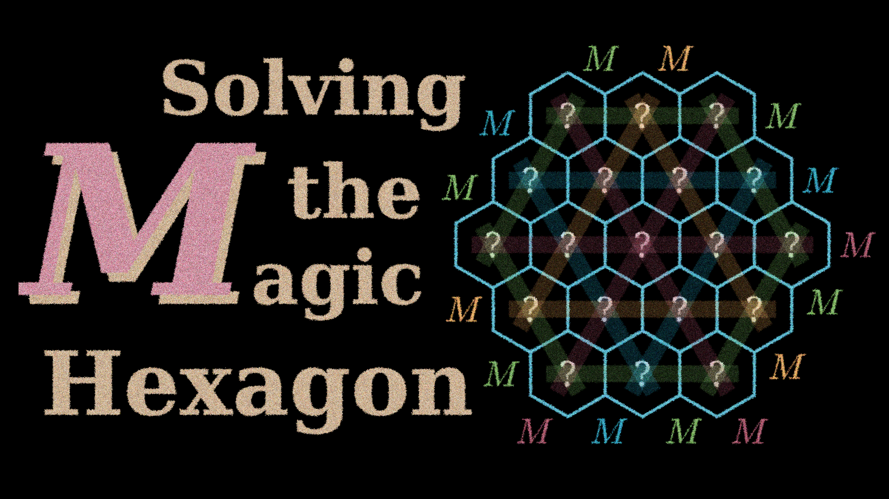

# Solving the Magic Hexagon Puzzle

This repository contains the code used to produce this video:

https://youtu.be/Qt1_lSniMqI

The actual puzzle is solved `solver.py`.

The files in `manim/` were used to produce the animations in the video. Note:
the animation files have minimal `wait()` calls; timing adjustments were made
later in editing.
